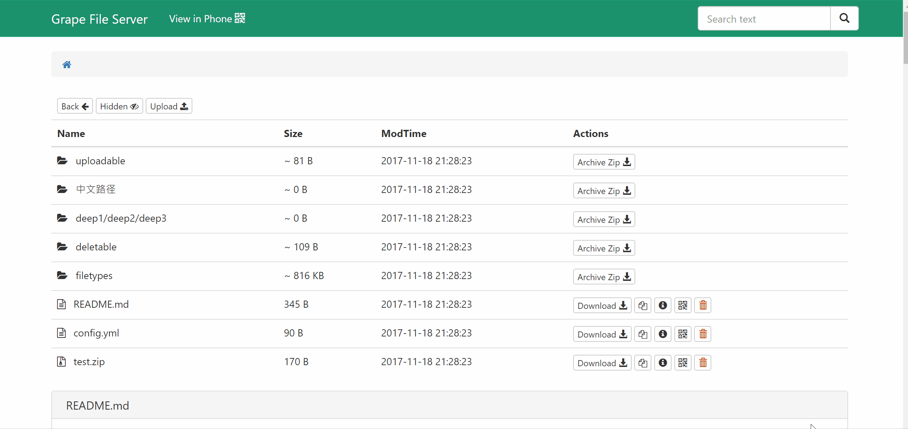
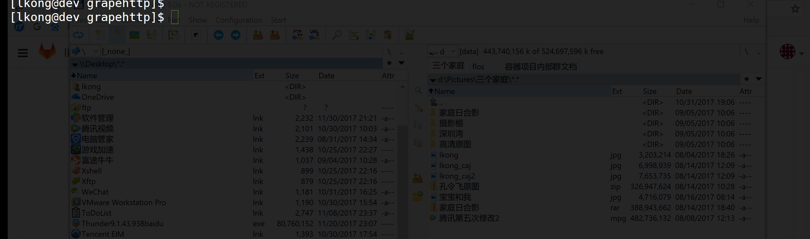
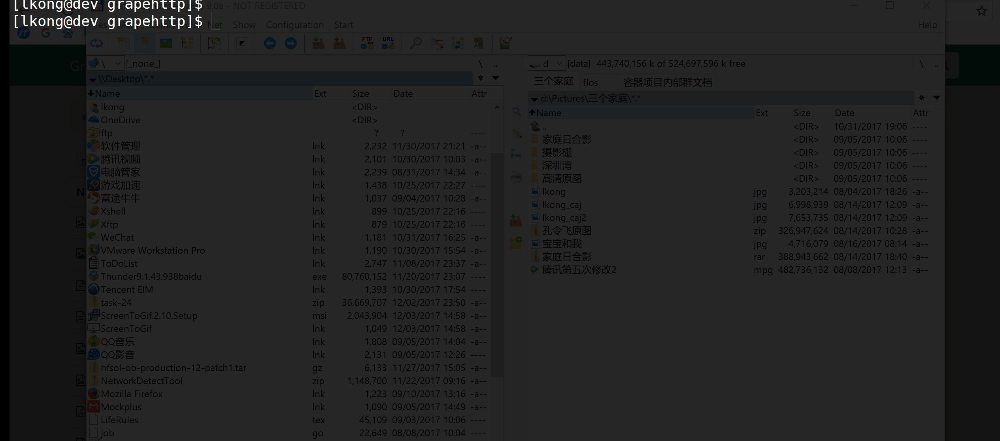

# grapehttp

超级好用的HTTP文件服务器，可以通过web端和命令行来访问和操作文件服务器。其他特性有文件夹访问权限控制，登陆授权等。

**需求背景**

1. 项目组没有一个公用的文件服务器，相互传文件不方便，不同电脑之间转移文件也不方便(密码一直在变)
2. 因为公司网络原因，上传文件到内网，需要通过rz, sz命令，这种方式传输速度慢，有一定几率会传输失败

## Screenshots
**Grapehttp Web UI**


**fctl File Server Commands**


**fctl User Control Commands**


## Features

+ 安装只需要一个单独的二进制文件，不需要其它依赖
+ 不同的文件展示不同的icon
+ 支持隐藏或者显示文件
+ 上传文件支持（安全起见，需要指定--upload参数）
+ README.md 文件预览
+ HTTP Basic Auth
+ 支持文件夹压缩成zip后下载
+ 线下下载支持
+ 全局文件搜索
+ Hidden work download and qrcode in small screen
+ 可选择不同的界面风格
+ 可以通过nginx代理
+ 文件夹权限控制(通过.ghs.yml文件)
+ 可以自定义Web界面标题
+ 支持配置文件
+ 快速复制下载链接
+ 显示文件夹大小
+ 客户端工具fctl支持子命令自动补全

## 安装 

### 安装前准备

**Binaries** can be downloaded from [this repo releases](https://github.com/lexkong/grapehttp/releases/)

**修改grapehttp的配置**

grapehttp的配置文件为：httpconfig.yaml

当simpleauth=false时，需要初始化tb_http_user表(假定已经下载或编译好了grapehttp)
```
./grapehttp -d -c httpconfig.yaml
```
初始化管理员用户名和密码为：admin:admin
这里主要修改rbac的对应项，rbac是用来对连接http server进行用户名和密码校验。


**修改fctl的配置:**
```
mkdir ~/.grape/ 
cp client/config.yaml ~/.grape/

```

### 二进制安装

1. 下载二进制文件：fctl 和 grapehttp

2. 启动grapehttp
```
./grapehttp -c httpconfig.yaml
```

3. 执行`./fctl -h`获取客户端fctl工具使用帮助


### 源码安装

```
git clone https://github.com/lexkong/grapehttp.git
make
./admin.sh start
./fctl ls /
```

### admin.sh操作

+ 启动服务：admin.sh start
+ 停止服务：admin.sh stop
+ 重启服务：admin.sh restart
+ 查看服务状态：admin.sh status

## fctl命令行工具Usage

### HTTP Server相关操作命令

```
ls          List directory contents
mkdir       Create specified directory
mv          Move (rename) files
cp          Copy files and directories
rm          Remove files or directories
upload      Upload files to remote http server
download    Download files from remote http server
```

### HTTP Server用户管理相关命令

```
add         Create a new user
del         Delete users
modify      Modify user's email, password, nickname and remark
search      Search users with fuzzy match condition
get         Get user informations
list        List existing users with mysql limit and offset
enable      Enable users
disable     Disable users
```

### 其它命令

```
finfo       Get http server basic information
help        Help about any command
version     Print the client and server version information
```

**更详细请查看：`./fctl -h` or `./fctl SUBCOMMAND -h`**

## 高级用法

通过在目录下创建`.ghs.yml`来增加该目录的权限控制规则, 例如：

```yaml
---
upload: false
delete: false
noaccess: false
users:
- username: "lkong"
  delete: true
  upload: true
```

在这个例子中，只有登录用户名为lkong的用户，才有权限在目录下执行删除和上传的操作。

通过在`.ghs.yml`文件中添加以下行，来控制哪些文件可见，哪些文件不可见。

```yaml
accessTables:
- regex: block.file
  allow: false
- regex: visual.file
  allow: true
```

### ipa plist proxy
如果服务器激活了https，可以这么用：

```
./gohttpserver --plistproxy=https://someproxyhost.com/
```

测试是否工作：

```sh
$ http POST https://proxyhost.com/plist < app.plist
{
	"key": "18f99211"
}
$ http GET https://proxyhost.com/plist/18f99211
# show the app.plist content
```

## fctl子命令自动补全

**暂时**
```
source <(fctl completion bash)
```

**永久**
```
fctl completion bash > ~/.grape/completion.bash.inc 
echo 'source $HOME/.grape/completion.bash.inc' >> $HOME/.bashrc
```

## 用`curl`命令上传文件

```
curl -F file=@foo.txt localhost:6664/somedir
```

## 如何构建单个二进制文件
```
go get github.com/goreleaser/goreleaser
go get github.com/jteeuwen/go-bindata/...
go get github.com/elazarl/go-bindata-assetfs/...
go-bindata-assetfs -tags bindata res/...
go build -tags bindata
goreleaser
```
